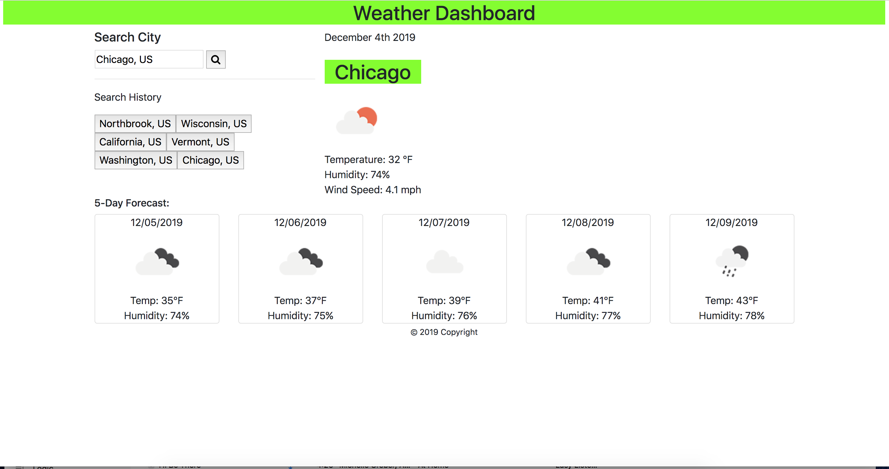

As a traveler,
I want to see the weather outlook for multiple cities,
so that I can plan a trip accordingly,
But to do that, I need to use the openweatherapi to have data of the current week forecast.
I logged in to get a API Key for a var API Key. Api keys are important to use to get current weather data from OpenWeatherAPI.
https://jmrosenberg12.github.io/Weather-Dashboard/

